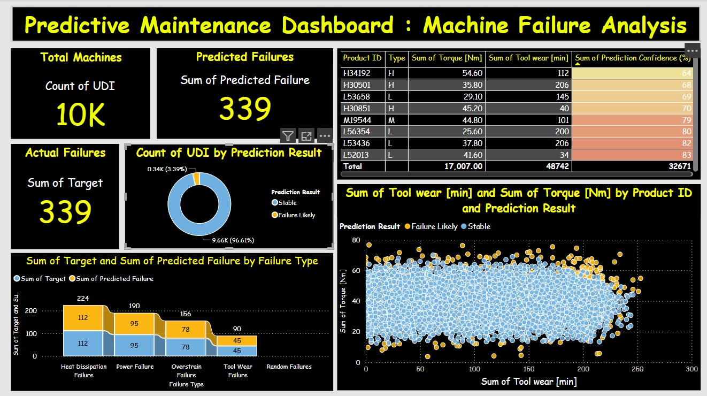

# Machine Data Analysis for Predictive Maintenance (PoC)

## 1. Overview

This project is a **Proof of Concept (PoC)** demonstrating a predictive maintenance system for industrial machinery. The primary goal is to analyze sensor data to predict potential machine failures before they occur. By identifying these risks early, we can enable proactive maintenance, reduce operational downtime, and minimize repair costs.

The system processes historical machine data, trains a machine learning model to recognize failure patterns, and provides predictions that can be visualized in an interactive dashboard.

---

## 2. Key Features

*   **Data Processing:** Cleans and preprocesses raw sensor data to make it suitable for machine learning.
*   **Predictive Modeling:** Utilizes a Random Forest Classifier to predict failure probabilities based on various sensor readings.
*   **Data Visualization:** An interactive Power BI dashboard to monitor key metrics and view failure predictions in a user-friendly format.
*   **Model Persistence:** The trained model and data scaler are saved, allowing for quick predictions on new data without retraining.

---

## 3. Tech Stack & Tools

*   **Programming Language:** Python 3
*   **Libraries:**
    *   Pandas: For data manipulation and analysis.
    *   Scikit-learn: For building and training the machine learning model.
    *   Joblib: For saving and loading the trained model.
*   **BI Tool:** Microsoft Power BI
*   **Version Control:** Git / Sourcetree

---

## 4. Project Structure

Here is a brief description of the key files in this repository:

```
.
├── 📄 predictive_maintenance.csv      # The raw dataset used for training and testing.
├── 🐍 data_cleaning.py                # Python script for data cleaning and preparation.
├── 🐍 predict_failure.py              # Python script to load the model and make new predictions.
├── 🤖 final_random_forest_model.joblib  # The saved, pre-trained Random Forest model.
├── ⚖️ data_scaler.joblib                # The saved scaler for normalizing new data.
├── 📊 Power BI.pbix                     # The Power BI dashboard file for visualization.
├── 📈 powerbi_dashboard_data.csv       # Processed data used as a source for the Power BI dashboard.
├── 📜 powerbi_prediction_log.csv      # A log file of predictions made.
└── 📄 README.md                         # This documentation file.
```

---

## 5. How to Use

### Prerequisites
- Python 3.8 or newer
- Required Python libraries: `pandas`, `scikit-learn`
- Microsoft Power BI Desktop

### A. To Make a New Prediction

1.  Place your new, raw data into a CSV file.
2.  Run the prediction script from your terminal:
    ```bash
    python predict_failure.py your_new_data.csv
    ```
3.  The script will output the predictions and save them to `powerbi_prediction_log.csv`.

### B. To View the Dashboard

1.  Open the `Power BI.pbix` file using Power BI Desktop.
2.  Click the "Refresh" button in the Home ribbon to update the dashboard with the latest data from `powerbi_dashboard_data.csv` and `powerbi_prediction_log.csv`.

---

## 6. Dashboard Preview

*(It is highly recommended to add a screenshot of your Power BI dashboard here to make the README more impressive.)*



---

## 7. Future Improvements

*   **Real-time Prediction:** Deploy the model as a REST API to enable real-time failure predictions from live sensor streams.
*   **Advanced Models:** Experiment with time-series models like LSTM for potentially higher accuracy.
*   **Automated Pipeline:** Create an automated data pipeline that handles data ingestion, processing, and prediction without manual intervention.
